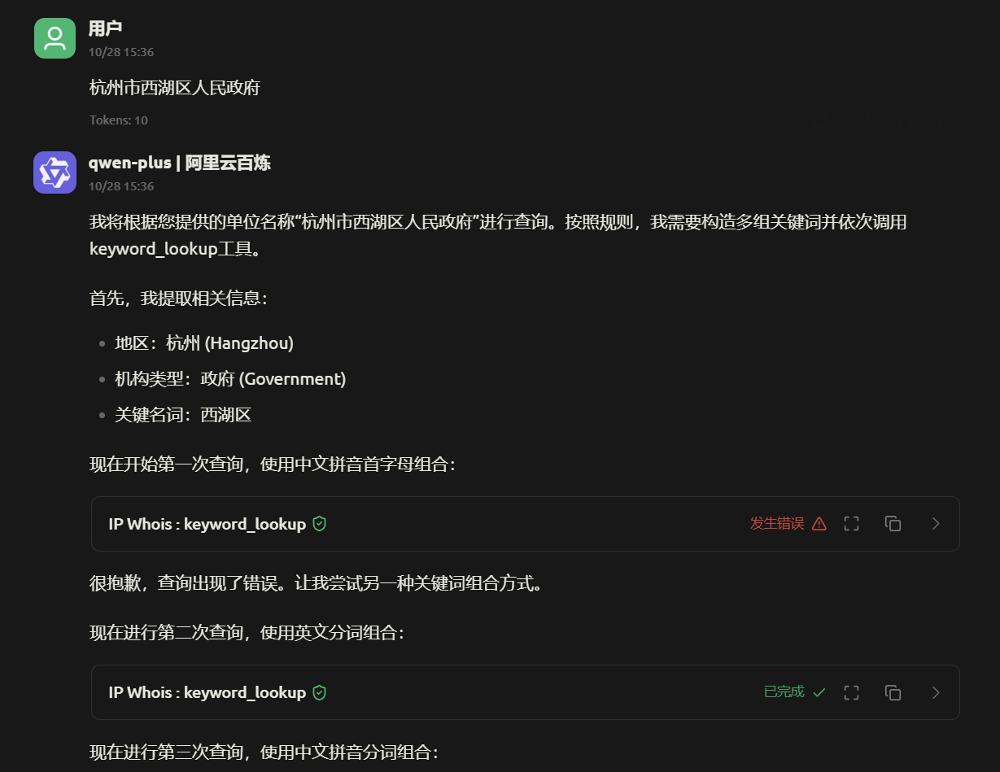

# IPSearch-MCP

离线IP Whois查询工具，现已支持MCP协议集成。

原项目： https://github.com/SleepingBag945/IPSearch

可根据关键词反向查询关联IP，收集目标资产。使用AI输入目标系统名称自动化反查IP段。

使用golang编写，纯Go实现支持交叉编译，一次编译到处运行。可以很方便的集成至师傅们的工作流中。

## 主要功能

### 1. IP查询（ip_lookup）
根据IPv4地址查询所属IP段以及IPWhois信息，包括：
- IP段范围（inetnum）
- 网络名称（netname）
- 归属国家（country）
- 详细描述（descr）
- 状态信息（status）
- 最后修改时间（last-modified）


MCP


### 2. 关键词查询（keyword_lookup）

根据IPWhois登记信息关键字搜索IP段，支持：
- 多关键词组合查询（逗号分隔）
- 同时匹配descr和netname字段
- 最多返回2000条结果


MCP




参考提示词

```
  - 若用户提供 IPv4 地址，请调用 ip_lookup 工具查询 IP Whois 信息，并返回包含 IP 段、名称、描述、国家、状态、最后修改等字段的结果。确保在调用前对 IP 做基础校验，非合法 IPv4 要提示用户重新输入。        
  - 若用户提供单位名称，请先判断所属地区、机构类型及关键名词，然后构造多组关键词多次调用 keyword_lookup 工具，具体规则（禁止使用单独的高匹配度关键词，如zhejiang,这会导致返回大量结果无法处理）：                                                                                     
      - 第一次：提取单位中文名称拼音首字母，示例：浙江第一人民医院 → zjdyrmyy。
      - 第二次：提取单位英文分词组合：示例：浙江第二人民医院 → zhejiang,second,hospital                                                                                                                 
      - 第三次：提取单位中文拼音分词组合，示例：浙江第一人民医院 → zhejiang,diyi,yiyuan                                                                   
      - 第三次：格式为“地区英文 + 公司主要拼音”，示例：吉林混论机械股份有限公司 → jilin,kunlun
      - 第四次：格式为“地区英文 + 公司主要英文”，示例：浙江酒股份有限公司 → zhejiang,wine,ltd  
  - 依次尝试上述关键词组合，即使前一个返回了结果，依旧需要走完所有规则。确保每次搜索的关键词字符串去除多余空格，必要时可以组合多个关键词一起查询（例如 zhejiang,hospital,first 与 zhejiang,hospital,zjdyrmyy）。       
  - 返回搜索结果时，请将IP段修改为CIDR的格式，并提供IP段归属为该公司的原因
    - 例子：
      1. 111.111.111.0/24 | IP段描述/名称原文 | 中文翻译
      2. 111.111.222.0/24 | IP段描述/名称原文 | 中文翻译因
      
```


## 技术特性

- **MCP协议支持**：作为MCP Server运行，可集成到支持MCP的AI客户端中
- **纯Go实现**：使用 `github.com/glebarez/go-sqlite` 驱动，支持完整交叉编译
- **离线数据库**：基于SQLite的IP.db数据库，无需网络连接
- **高性能查询**：优化的SQL查询和索引设计

IP.db为SQLite格式的IP数据库，若此工具不满足要求可用此库自己实现。

## 使用方法

### 编译

```bash
# 克隆代码
git clone <repository-url>
cd IPSearch

# 编译当前平台
go build -o IPSearch

# 交叉编译示例
# Linux AMD64
GOOS=linux GOARCH=amd64 go build -o IPSearch-linux-amd64

# macOS AMD64
GOOS=darwin GOARCH=amd64 go build -o IPSearch-darwin-amd64

# macOS ARM64 (M1/M2)
GOOS=darwin GOARCH=arm64 go build -o IPSearch-darwin-arm64

# Windows AMD64
GOOS=windows GOARCH=amd64 go build -o IPSearch-windows-amd64.exe
```

### 运行

1. 下载源码编译或者在Release下载适合自己系统的IPSearch

2. 下载IP.zip，解压后把IP.db放在IPSearch同目录下

3. 在cherrystudio配置对应的MCP服务器

   

   

4. 工具将通过标准输入输出与MCP客户端通信

### MCP工具说明

#### ip_lookup
- **参数**：`ip` (string, 必需) - 待查询的IPv4地址
- **返回**：IP段及完整的IPWhois信息

#### keyword_lookup  
- **参数**：`keywords` (string, 必需) - 逗号分隔的关键字列表
- **返回**：匹配的IP段列表（最多2000条）

## 依赖说明

- Go 1.23.0+
- `github.com/glebarez/go-sqlite` - 纯Go SQLite驱动，支持交叉编译
- `github.com/mark3labs/mcp-go` - MCP协议实现
